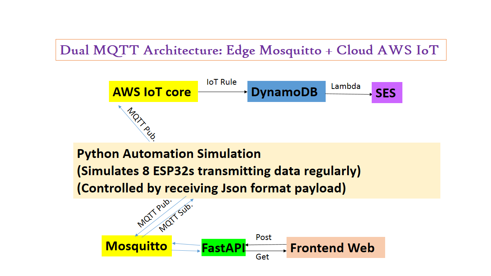
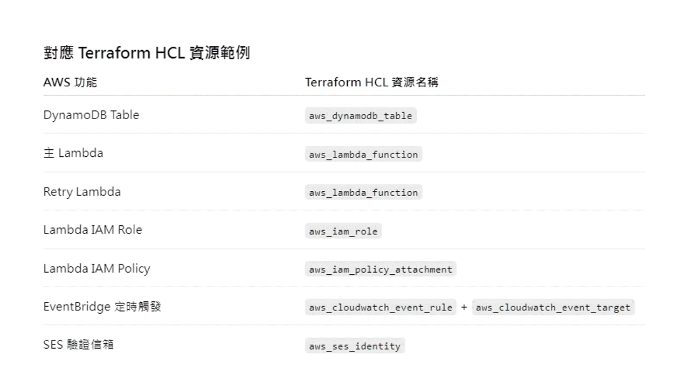
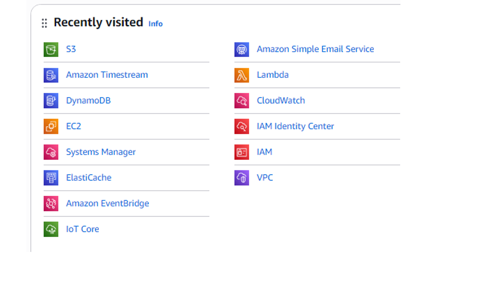

# 📘 SmartIoT V4 --- Edge-to-Cloud Monitoring System

**(Mosquitto × AWS IoT × DynamoDB)**\
Bi-directional MQTT Control, Cloud Alerting, and Scalable Device
Simulation

------------------------------------------------------------------------

## 🧩 System Overview

SmartIoT V4 是一個 **邊緣到雲端的物聯網監控系統**，透過 Mosquitto MQTT
Broker 進行雙向通訊，結合 AWS 雲端服務（IoT
Core、Lambda、DynamoDB、SES），實現即時資料監控、危險指數運算、與自動警報寄送。

本系統可模擬多台裝置上傳溫濕度資料，並在雲端自動觸發警報機制，未來可擴展成完整的時間序列與快取架構。

------------------------------------------------------------------------
---

## 🧠 Key Technologies (Module-wise)

### 1️⃣ 後端：FastAPI 控制與狀態服務

**功能**：

* 提供 HTTP API 供前端頁面使用
* 控制多設備 LED
* 回傳設備狀態與 DHT22 資料
* 支援 CORS，讓前端可跨域呼叫
* 與 MQTT broker (Mosquitto) 通訊

**Key Technologies**：

* **FastAPI** — 高效能 Python Web 框架
* **uvicorn** — ASGI server，支援非同步 I/O
* **paho-mqtt** — MQTT 通訊，用於設備控制與狀態更新
* **CORS Middleware** — 前端跨域請求支持
* **Python threading** — 背景執行 MQTT loop

---

### 2️⃣ 前端：HTML + JavaScript 控制面板

**功能**：

* 顯示每個設備的 LED 狀態
* 可對每個 LED 或全設備進行開/關操作
* 顯示多設備的 DHT22 溫濕度資訊表格
* 支援即時刷新狀態（每秒輪詢）
* 斷線/重連功能與狀態顯示

**Key Technologies**：

* **HTML5 / CSS3 / Bootstrap 5** — 響應式 UI 與表格樣式
* **JavaScript (ES6)** — 動態操作 DOM 與狀態更新
* **Fetch API** — 與後端 HTTP API 通訊
* **DOM Manipulation** — LED 狀態與表格內容即時更新
* **自訂 CSS 變數** — 表格奇偶列配色與主題色彩

---

### 3️⃣ 模擬端：設備資料與 MQTT 上傳

**功能**：

* 模擬多個設備 LED 狀態
* 模擬 DHT22 溫濕度資料，每 5 秒發佈一次
* 同時推送到本地 Mosquitto 與 AWS IoT Core
* 接收控制訊息，更新 LED 狀態

**Key Technologies**：

* **Python + threading** — 背景資料生成與發布
* **paho-mqtt** — 同時連接本地與雲端 MQTT broker
* **JSON** — 結構化資料傳輸
* **AWS IoT Core MQTT** — 雲端設備資料接收與整合
* **Mosquitto MQTT Broker** — 本地快速測試與控制
* **random & time** — 模擬溫濕度與時間戳

---

### 4️⃣ Lambda (AWS) — Danger Index 計算與通知

**功能**：

* 監控 DynamoDB 中的設備資料
* 計算 Danger Index : Danger Index危險係數的算法是「室外溫度＋相對濕度×0.1」。
* 發送最多 3 封 Email 警告（對未驗證信箱暫不處理）
* 寫入 Redis 快取及 Timestream for InfluxDB (時間序列資料)
* 未來可擴充 EventBridge 驗證未認證信箱

**Key Technologies**：

* **AWS Lambda** — Serverless Event-driven backend
* **AWS DynamoDB** — 主資料庫與觸發器
* **Redis (ElastiCache)** — 快取最新資料，降低查詢延遲
* **Timestream for InfluxDB** — 時間序列資料存儲
* **AWS SES / Email** — 事件通知
* **Python boto3** — AWS SDK
* **Terraform** — Lambda 與 IAM role 基礎設置與管理

---

### 5️⃣ Grafana on EC2 — 可視化與警示

**功能**：

* 從 Timestream / Redis 抓取資料
* 顯示多設備溫濕度與 Danger Index 折線圖
* 設定警示閾值 (Danger Index > 40 顯示紅色)
* 未來可延伸自訂多種儀表板

**Key Technologies**：

* **Grafana (自建於 EC2)** — 雲端可視化平台
* **Timestream for InfluxDB Data Source** — 時間序列資料視覺化
* **Redis Data Source** — 快取即時資料呈現
* **EC2** — 彈性部署與管理 Grafana 服務
* **自訂面板 & Alerting Rules** — 異常警示設定

---

## ⚙️ 系統架構等





> 未來可擴展 EventBridge 定時檢查未驗證信箱或長時間未回報設備。

---
------------------------------------------------------------------------

## ⚙️ Current Architecture 

    [Device Simulator / ESP32]
       ├─ 上傳溫濕度數據至 Mosquitto MQTT Broker
       ↓
    [AWS IoT Core]
       ├─ 將 MQTT 訊息轉發至 DynamoDB
       ↓
    [DynamoDB (device_data)]
       ├─ 儲存每筆裝置資料
       └─ 觸發 DynamoDB Stream
       ↓
    [AWS Lambda - process_device_data]
       ├─ 從 DynamoDB 讀取新資料
       ├─ 計算 danger_index
       ├─ 檢查是否達到寄信上限 (每裝置最多 3 封)
       └─ 使用 Amazon SES 寄送警報信
       ↓ (未來延伸)
    [AWS EventBridge - 定時觸發]
       ├─ 檢查未驗證信箱
       ├─ 檢查長時間未回報裝置
       ↓
    [Grafana on AWS EC2]
       ├─ 顯示各裝置溫濕度與 danger_index 趨勢圖
       └─ 設定警示閾值（danger_index > 40 顯示紅色）

------------------------------------------------------------------------

## 🚀 Features Implemented (現已完成)

✅ **雙向 MQTT 通訊**（Mosquitto Broker）\
✅ **DynamoDB 儲存設備資料**\
✅ **Lambda 自動觸發（由 DynamoDB Stream 啟動）**\
✅ **Danger Index 計算與 Email 警報（每裝置限寄 3 封）**\
✅ **可支援多設備模擬上報測試**
✅ **InfluxDB假資料顯示在EC2的Grafana上面**
------------------------------------------------------------------------

## 🔮 Future Extension

🕒 **EventBridge 定時排程檢查** - 檢查未驗證信箱 -
檢查長時間未更新之裝置 - 寫入 Redis 快取供即時查詢 - 同步資料至
Timestream for 時間序列分析

📊 **Grafana 整合 (EC2 部署)** - 可視化多設備溫濕度與 Danger Index -
設定動態警報閾值（紅色警示 \> 40）

------------------------------------------------------------------------
## 📈 Data Flow Summary

1. Devices → Mosquitto (local) → FastAPI backend → Frontend
2. Devices → AWS IoT Core → Lambda → DynamoDB, Redis, Timestream
3. Timestream + Redis → Grafana (EC2) → Visualization & Alerting

-----------------------------------------------------------------------

## 🧠 Project Structure

    terraformDev/
    ├─ main.tf
    ├─ Lambda.tf
    ├─ Timestream&Redis_Dev.tf
    ├─ GrafanaDashboard.tf
    ├─ lambda_shared.zip
    │   ├─ Lambda_function.py
    │   ├─ redis/
    │   ├─ async_timeout/
    │   └─ 相關套件資料夾
    └─ README.md

------------------------------------------------------------------------

## 📡 Lambda Trigger Logic

-   **Trigger Source**: DynamoDB Stream (INSERT event)\
-   **Trigger Function**: `process_device_data`\
-   **Action**:
    1.  取得新資料\
    2.  計算 danger_index\
    3.  寄送警報信（限制每裝置 3 封）\
    4.  記錄寄信次數

------------------------------------------------------------------------

## 📬 Email Alert Example (via Amazon SES)

``` txt
Subject: ⚠️ Device Alert - High Danger Index
Body:
Device ID: 12345
Temperature: 35.6°C
Humidity: 80%
Danger Index: 43.2 (⚠️)
```

------------------------------------------------------------------------

## 🧱 AWS Components Used

  Service                    Purpose
  -------------------------- ---------------------------
  **IoT Core**               接收裝置 MQTT 資料
  **DynamoDB**               儲存設備數據與觸發 Lambda
  **Lambda**                 處理資料與寄送警報
  **SES**                    郵件通知
  **EventBridge (Future)**   定時檢查機制
  **EC2 + Grafana**          資料可視化儀表板
  **CloudWatch**             錯誤訊息檢視
------------------------------------------------------------------------

## 👨‍💻 Author

**奕辰 (Eric Li)**\
IoT Full-Stack Developer \| Edge & Cloud Integrator\
Specialized in ESP32 × AWS × Django × Android Integration

------------------------------------------------------------------------
*程式碼僅做部分公開(不能跑系統)，只是為了證明本人親自獨立完成此系統。
------------------------------------------------------------------------


© 2025 奕辰. All rights reserved.